<!-- customize-you-profile:start -->
<!-- Generated by CustomizeYouProfile: this block is rewritten on every run. Move the whole block anywhere you like, or set `update-readme: false` to place the images yourself. -->
<picture>
  <source media="(prefers-color-scheme: dark)" srcset="profile-effects/intro-dark.svg">
  
</picture>

<picture>
  <source media="(prefers-color-scheme: dark)" srcset="profile-effects/skills-dark.svg">
  
</picture>

<picture>
  <source media="(prefers-color-scheme: dark)" srcset="profile-effects/dino-run-dark.svg">
  
</picture>

<picture>
  <source media="(prefers-color-scheme: dark)" srcset="profile-effects/space-shooter-dark.svg">
  
</picture>
<!-- customize-you-profile:end -->

Developer focused on building practical business systems such as dashboards, CRM, ERP, LINE OA platforms, LIFF applications, booking systems, API integrations, and AI-assisted workflow tools.

My main strength is building systems that are not only functional, but also useful for real business operations — including customer management, order flow, admin dashboards, automation, and internal tools.

---

## 🚀 Focus Areas

- Fullstack Web Application
- Admin Dashboard / Backoffice System
- CRM / ERP System
- LINE OA / LIFF Integration
- API Integration
- Database-driven Business System
- AI-assisted Workflow Tools
- Automation for Sales / Customer Support / Operation Teams

---

## 🛠 Tech Stack

### Frontend
- React
- Next.js
- TypeScript
- Tailwind CSS
- shadcn/ui
- Responsive UI
- Dashboard / Admin Panel UI

### Backend
- Node.js
- NestJS
- Express
- REST API
- Webhook
- Authentication
- Role-based Access Control

### Database
- PostgreSQL
- MySQL
- Supabase
- Database Schema Design
- Data Modeling

### Tools & DevOps
- Docker
- Git / GitHub
- pnpm / npm
- API Testing
- Debugging
- Deployment Workflow

### Integration
- LINE Messaging API
- LINE LIFF
- LINE Webhook
- Payment API Concept
- AI API Integration
- Automation Workflow

---

## 📌 Selected Projects

### 1. Telepharmacy ERP  
🔗 https://github.com/reyatelehealth2026-crypto/telepharmacy-erp.git

A telepharmacy ERP / backoffice system for online pharmacy operations.  
The project focuses on customer management, order flow, product management, LINE integration, admin dashboard, and AI/OCR workflow concept.

**Highlights**
- Admin Dashboard
- Backend API
- Database System
- LINE Integration
- Order / Product / Customer Flow
- AI / OCR Workflow Concept
- Business Operation System

---

### 2. LINEX-BOOk — LINE Booking SaaS  
🔗 https://github.com/reyatelehealth2026-crypto/LINEX-BOOk.git

A LINE-based booking SaaS for service businesses such as salons, nail shops, spas, and appointment-based businesses.

**Highlights**
- LINE LIFF
- Booking System
- Customer Management
- Admin Panel
- Multi-tenant Concept
- Realtime Workflow
- API / Database Integration

---

### 3. InboxReya — LINE OA Manager  
🔗 https://github.com/reyatelehealth2026-crypto/inboxreya.git

A LINE Official Account management system for admin teams to handle customer messages, broadcast, auto-reply, online shop flow, and basic analytics.

**Highlights**
- LINE OA Workflow
- Message Management
- Broadcast System
- Auto Reply
- User Management
- Dashboard / Analytics

---

### 4. CRM / Backoffice Platform  
🔗 https://github.com/reyatelehealth2026-crypto/odoo.git

A CRM / backoffice platform for managing customer data, LINE chat workflow, products, orders, and business operations.

**Highlights**
- CRM System
- Customer Data Management
- Product / Order Management
- LINE Chat Workflow
- Dashboard / Reporting

---

### 5. C-Office — AI Agent Command Center  
🔗 https://github.com/vrzycodex/c-office.git

An AI Agent Command Center for monitoring and managing AI agent workflows through a realtime dashboard.

**Highlights**
- AI Workflow Dashboard
- Realtime Monitoring
- Agent Command Center
- Internal Tool UI
- Product Dashboard Thinking

**GitHub:** 
- https://github.com/reyatelehealth2026-crypto  
- https://github.com/vrzycodex
